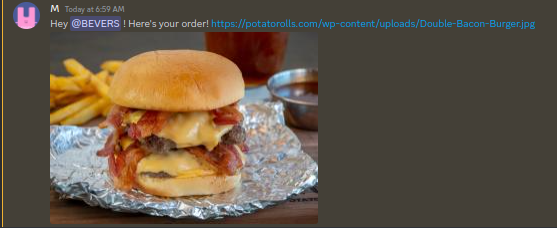

# Serverdash



#### Order (a picture of) anything (within reason) from your Discord server! Powered by real life humans!

[Invite Serverdash to your server](https://discord.kitchen/) to order something! You can also [join the kitchen](https://discord.kitchen/kitchen) to help fill orders (or if you need help, or if you just want to be there :)!

## Self-hosting

if for some reason anyone ever wanted to. Get yourself a [Discord bot](https://discord.com/developers) and a postgres database and an s3 bucket. Clone the repo & run `pnpm install`. Then set up a ridiculous amount of environment variables:

```env
DSC_TOKEN= # Your bot token
DATABASE_URL= # Your database url
AWS_ACCESS_KEY_ID="" # s3 credentials
AWS_SECRET_ACCESS_KEY=""
S3_REGION=""
S3_BUCKET=""
FILE_URL_PREFIX="" # optional. no trailing slash.
KITCHEN_SERVER_ID= # The server where all the orders will come in
NEW_ORDERS_CHANNEL_ID= # Then a bunch of channel ids for various stages of the order
FILL_ORDERS_CHANNEL_ID=
READY_ORDERS_CHANNEL_ID=
DELIVERING_ORDERS_CHANNEL_ID=
DELIVERED_ORDERS_CHANNEL_ID=
CANCELLED_ORDERS_CHANNEL_ID=
LOGS_CHANNEL_ID=
CHEF_CHAT_CHANNEL_ID=
ORDER_PING_ROLE_ID= # Role pinged when a new order comes in
DELIVERY_PING_ROLE_ID= #same for ready for delivery
DEVELOPERS= # Space separated list of ids, people who can use `/devtools`. optional.
```

Oh but wait, there's 8 more! The bot needs to create webhooks for each of those order channels. Run `npx tsx src/createWebhooks.ts` and copy the outputted variables. If it helps, this script only needs the bot token, kitchen server id, and ids of channels.
It's important that the bot makes these webhooks, otherwise it won't be able to add components to messages.

Then `npx tsc` and `node dist/index.js` and you're good to go!
